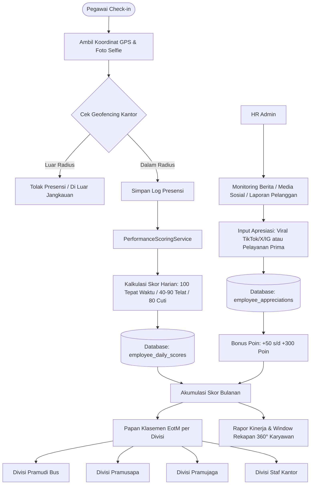
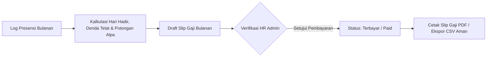

# HRIS Transjakarta - Human Resource Information System

Sistem Informasi Manajemen Sumber Daya Manusia dan Operasional PT Transportasi Jakarta (Transjakarta) berbasis web Single Page Application (SPA) yang dibangun dengan Laravel 11, Inertia.js (Vue 3), dan Tailwind CSS.

---

## Panduan Instalasi Cepat

### Opsi 1: Instalasi Lokal (Laragon / XAMPP / Native)

1. **Clone & Install Dependensi**
   ```bash
   git clone https://github.com/RissN/Absensi-app.git
   cd Absensi-app
   composer install
   npm install
   ```

2. **Konfigurasi Environment**
   ```bash
   cp .env.example .env
   php artisan key:generate
   ```
   Pastikan pengaturan database di file `.env` sudah sesuai dengan MySQL lokal Anda (misal: `DB_DATABASE=absensi_app`).

3. **Migrasi, Seeding & Storage Link**
   ```bash
   php artisan migrate:fresh --seed
   php artisan storage:link
   ```
   *Seeder akan otomatis mengisi 3.520 data pegawai Transjakarta dengan nama asli manusia Indonesia, pengaturan kantor, jadwal shift, dan data kinerja bulanan.*

4. **Kompilasi Aset & Jalankan Server**
   ```bash
   npm run build
   php artisan serve
   ```
   Buka peramban di `http://localhost:8000`. Untuk pengembangan aktif, jalankan `npm run dev`.

---

### Opsi 2: Menggunakan Docker

1. **Salin File Environment Docker**
   ```bash
   cp .env.docker.example .env
   ```

2. **Jalankan Container & Migrasi**
   ```bash
   docker compose up -d --build
   docker compose exec app php artisan migrate:fresh --seed
   docker compose exec app php artisan storage:link
   ```
   - Web App: `http://localhost:8000`
   - phpMyAdmin: `http://localhost:8080`

---

## Akun Demo Pengujian

| Peran | Email | Kata Sandi | Hak Akses & Keterangan |
| :--- | :--- | :--- | :--- |
| Admin HR | `admin@absensi.com` | `password` | Akses penuh dashboard, monitoring staf, kinerja, apresiasi, cuti, dan payroll. |
| Pramudi (Tetap) | `budi@absensi.com` | `password` | Portal mobile staf, presensi GPS/selfie, pengajuan cuti, dan slip gaji. |
| Pramusapa (Tetap) | `siti@absensi.com` | `password` | Pengujian jadwal operasional, rekap absensi, dan notifikasi staf. |

---

## Arsitektur & Alur Kerja Sistem

### 1. Flowchart Presensi, Penilaian Kinerja & Employee of the Month



### 2. Flowchart Penggajian & Verifikasi Operasional (Payroll)



---

## Modul & Fitur Utama

### 1. Manajemen Talenta, Kinerja & Employee of the Month (EotM)
- **Penilaian Disiplin Harian Otomatis**: Menghitung poin presensi setiap hari kerja (100 tepat waktu, 40-90 keterlambatan berjenjang, 80 izin/cuti resmi, 0 alpa).
- **Klasemen Terpisah per 4 Divisi Profesi**: Klasemen persaingan yang adil dan terpisah antara:
  - *Pramudi* (Pengemudi Bus Gandeng, Single & Mikrotrans)
  - *Pramusapa* (Petugas Layanan Halte & Bus)
  - *Pramujaga* (Petugas Keamanan Jalur Koridor)
  - *Karyawan Kantor* (Operasional OCC, IT, Dispatcher & Manajemen)
- **Podium Juara 1, 2, dan 3**: Penobatan *Employee of the Month* setiap bulan per posisi dengan kartu visual elegan.
- **Poin Apresiasi HR (Medsos Viral & Integritas)**: Admin HR dapat menginput bonus poin (+50 hingga +300) bagi karyawan yang berprestasi, viral di media sosial (TikTok, X, Instagram) karena membantu penumpang, atau tindakan kejujuran luar biasa. Dilengkapi tautan bukti medsos terverifikasi.
- **Window Rekapan Profil 360° Karyawan**: Klik pada nama karyawan di mana saja untuk membuka jendela rekapan komprehensif berisi:
  - Profil kepegawaian, kontak, dan depo pangkalan armada.
  - Rapor kinerja bulanan dan rincian kedisiplinan (tepat waktu, telat, cuti, alpa).
  - Koleksi apresiasi penghargaan dan tautan bukti digital.
  - Tabel 10 riwayat log presensi terakhir.

### 2. Monitoring Wilayah & Peta Administrasi DKI Jakarta
- **Peta Administrasi Resmi DKI Jakarta**: Representasi kartografi resmi Provinsi DKI Jakarta mencakup siluet garis pantai Teluk Jakarta, batas wilayah kabupaten/kota, ornamen kompas, legenda, serta lambang resmi Jaya Raya.
- **Persebaran 3.520 Pegawai Transjakarta**:
  - Jakarta Timur (1.060 pegawai - Pool Cawang, Pinang Ranti, Klender, Kp. Rambutan)
  - Jakarta Barat (930 pegawai - Pool Rawa Buaya, Pesing, Kalideres)
  - Jakarta Pusat (830 pegawai - Kantor Pusat Cawang, Halte Sentral Harmoni, Monas)
  - Jakarta Utara (700 pegawai - Pool Pegangsaan Dua, Tanjung Priok, Pluit)
- **Filter Status Kepegawaian**: Klasifikasi Staf Tetap (PKWTT), Vendor Mitra Operator (PKWT), dan Siswa Magang.
- **Mode Peta Ganda**: Pilihan antara Peta Administrasi Wilayah atau Peta Interaktif GIS (OpenStreetMap & Satelit Citra).

### 3. Portal Pegawai (Mobile-Friendly)
- **Presensi Geofencing GPS**: Perhitungan jarak akurat menggunakan formula Haversine dengan toleransi radius meter yang dinamis, disertai foto selfie kehadiran.
- **Dasbor Beranda Pegawai**: Pengumuman penting perusahaan, memo dinas, dan kalender hari libur nasional secara real-time.
- **Manajemen Saldo Cuti**: Pelacakan kuota cuti tahunan (12 hari), riwayat izin/sakit, dan unggah surat dokter.
- **Komplain Presensi**: Form sanggahan kehadiran jika terjadi kendala teknis perangkat saat tugas lapangan.
- **Slip Gaji Mandiri**: Cetak slip penerimaan gaji bulanan langsung dari smartphone.

### 4. Manajemen HR, Penggajian & Laporan
- **Estimator Payroll**: Perhitungan gaji pokok, tunjangan kehadiran, denda keterlambatan, dan potongan alpa secara instan.
- **Rekapitulasi & Ekspor Laporan**: Penyaringan data multi-kriteria dan ekspor CSV aman yang dilengkapi proteksi injeksi formula spreadsheet (BOM UTF-8).
- **Pengaturan Lokasi Kantor**: Fleksibilitas penentuan titik koordinat kantor utama dan radius validasi presensi.

---

## Standar Keamanan Sistem

- **Middleware Penonaktifan Akun**: Akun yang dinonaktifkan oleh HR ditolak secara instan pada request berikutnya (`EnsureUserIsActive`).
- **Security Response Headers**: Dilengkapi header proteksi `X-Frame-Options`, `X-Content-Type-Options`, `Referrer-Policy`, dan `Permissions-Policy`.
- **Proteksi Injeksi Formula CSV**: Karakter berisiko seperti `=`, `+`, `-`, `@` pada kolom data disanitasi otomatis sebelum file laporan diunduh.
- **Validasi Anti-Spoofing GPS**: Koordinat presensi divalidasi silang di server untuk mencegah manipulasi lokasi tiruan.

---

## Tumpukan Teknologi (Tech Stack)

- **Backend**: Laravel 11 (PHP 8.3)
- **Frontend**: Vue 3 (Composition API), Inertia.js v2
- **Styling**: Tailwind CSS, Bootstrap Icons
- **Peta GIS**: Leaflet.js, OpenStreetMap
- **Database**: MySQL 8.x
- **Kompilasi Aset**: Vite 6
- **Standar Kode**: Laravel Pint, PHPUnit (18 Unit Tests Passing)

---

## Lisensi

Aplikasi ini dilisensikan di bawah [MIT License](LICENSE).
